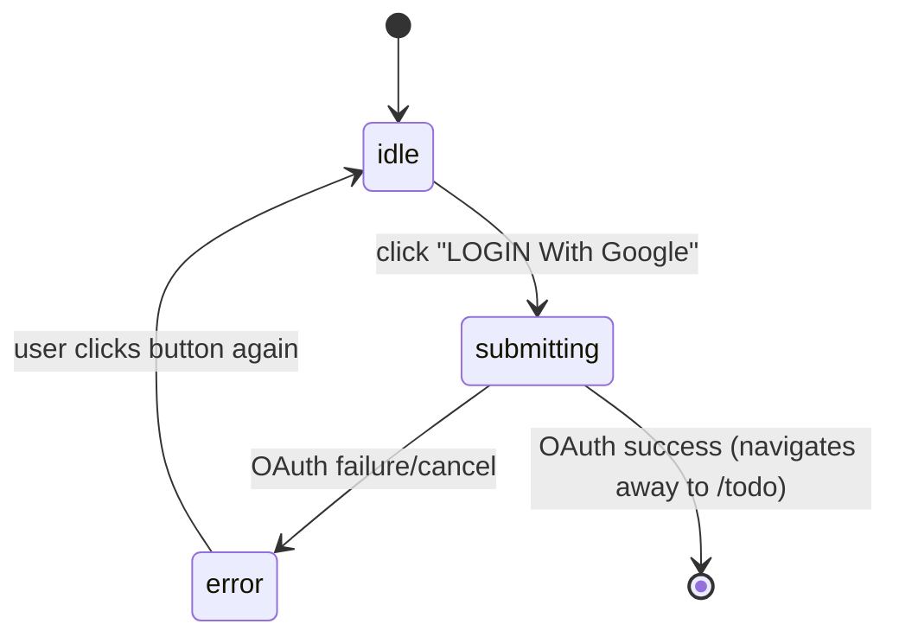

# Technical Spec — login (SAA 2025 Login Screen)

**Priority**: P1
**Type**: ui
**Generated**: 2026-07-16

## Overview

Single-screen login gate for the Sun* Annual Awards 2025 "ROOT FURTHER" app. Unauthenticated
visitors land on a dark hero screen with a Google OAuth "LOGIN With Google" button (all Google
accounts allowed, no domain allowlist) backed by Supabase Auth; on success they land on `/todo`
(placeholder home). Authenticated users hitting `/login` are bounced straight to `/todo`, and
unauthenticated users hitting `/todo` are bounced back to `/login` — enforced via Supabase SSR
middleware. A VN/EN language selector (default VN, `NEXT_LOCALE` cookie) switches all UI copy.

## Polymorphic Behavior

N/A — no discriminator fields in Key Entities. Auth state (authenticated/unauthenticated) is a
single boolean-shaped condition, not a multi-value discriminator — its behavior is captured under
`## Cross-Cutting Logic > ### Business Rules` (BR-002, BR-003) rather than as a DISC-### table.

## Cross-Cutting Logic

### Requirements

| Code | Description | Endpoint/Handler | Verifiable |
|------|-------------|------------------|------------|
| FR-001 | Initiate Google OAuth sign-in via Supabase Auth from the Login screen | Client: browser client `signInWithOAuth` + client callback page `/auth/callback` | yes |
| FR-002 | Redirect an already-authenticated user away from `/login` to `/todo` | Client guard (`use-auth-guard.ts`, client-only auth) | yes |
| FR-003 | Redirect an unauthenticated user away from `/todo` to `/login` | Client guard (`use-auth-guard.ts`, client-only auth) | yes |
| FR-004 | Persist and apply the selected UI language (VN/EN) via `NEXT_LOCALE` cookie, default VN | next-intl request config (cookie-based, no middleware) | yes |

**Source:** TBD (draft) — no source code written yet.

### Business Rules

### BR-001_AllGoogleAccountsAllowed
**Linked FR:** FR-001
**Source:** TBD (draft)
**Applies to:** Google OAuth sign-in
**Rule:** Any Google account can complete sign-in — there is no email-domain allowlist or org
restriction. This is a deliberate product decision (see feature intent), not an oversight.

**Pseudocode:**
```text
on oauth_success(user):
  # no domain/allowlist check — accept any verified Google account
  create_or_reuse_session(user)
  redirect("/todo")
```

### BR-002_AuthenticatedUserRedirectedFromLogin
**Linked FR:** FR-002
**Source:** TBD (draft)
**Applies to:** `/login` route entry
**Rule:** If a valid Supabase session exists when `/login` is requested, the middleware redirects
to `/todo` before the Login screen renders.

**Pseudocode:**
```text
on request("/login"):
  if session.exists: redirect("/todo")
  else: render LoginScreen
```

### BR-003_UnauthenticatedUserRedirectedFromTodo
**Linked FR:** FR-003
**Source:** TBD (draft)
**Applies to:** `/todo` route entry
**Rule:** If no valid Supabase session exists when `/todo` is requested, the middleware redirects
to `/login`.

**Pseudocode:**
```text
on request("/todo"):
  if !session.exists: redirect("/login")
  else: render TodoScreen
```

### BR-004_LoginButtonDisabledDuringAuth
**Linked FR:** FR-001
**Source:** TBD (draft)
**Applies to:** "LOGIN With Google" button
**Rule:** From click until the OAuth round-trip resolves (success, failure, or cancel), the button
shows a loading indicator and is disabled to prevent duplicate submissions.

**Pseudocode:**
```text
on click(login_button):
  set_state(submitting)
  start_oauth()
  # button disabled + spinner while state == submitting
```

### BR-005_OAuthFailureMessage
**Linked FR:** FR-001
**Source:** TBD (draft)
**Applies to:** OAuth failure/cancel path
**Rule:** If Google auth fails or the user cancels, show the localized message "Đăng nhập không
thành công. Vui lòng thử lại." and return the button to idle (re-enabled, no spinner).

**Pseudocode:**
```text
on oauth_error_or_cancel():
  set_state(error)
  show_message("Đăng nhập không thành công. Vui lòng thử lại.")
```

### BR-006_DefaultLocaleVietnamese
**Linked FR:** FR-004
**Source:** TBD (draft)
**Applies to:** i18n locale resolution
**Rule:** When no `NEXT_LOCALE` cookie is present, the UI defaults to Vietnamese (VN).

**Pseudocode:**
```text
locale = cookies.NEXT_LOCALE ?? "vi"
render_ui(locale)
```

### Decision Logic

N/A — no user-facing decision logic beyond DISC-### Polymorphic Behavior. The auth-state redirects
(BR-002/BR-003) are cross-screen navigation and belong to screen-flow territory, not an in-feature
DEC; there is no multi-predicate render/interaction/flow branch confined to this single screen.

### State Machines

**`kind` values:**
- `entity` — persisted domain state (n/a here — no persisted UI-relevant entity state beyond the
  Supabase session, which is opaque to this feature).
- `ui` — component-local, not persisted.

### SM-001_LoginButtonStatus
**kind:** ui
**Linked FR:** FR-001, BR-004, BR-005
**Source:** TBD (draft)
**States:** idle, submitting, error



**Transition rules:**
- `idle → submitting`: guard = none; side effect = disable button, show loading indicator, start OAuth
- `submitting → error`: guard = OAuth denied or cancelled; side effect = show BR-005 error message, re-enable button
- `submitting → (navigate away)`: guard = OAuth success; side effect = redirect to `/todo`
- `error → idle`: guard = user retries; side effect = clear error message

### Algorithms

None.

### External Integrations

### INT-001_GoogleOAuthViaSupabase
**Linked FR:** FR-001
**Source:** TBD (draft)
**Type:** api-call
**Target:** Supabase Auth (Google OAuth provider), configured via `[auth.external.google]` wired
from `GOOGLE_CLIENT_ID` / `GOOGLE_CLIENT_SECRET` env vars
**Trigger:** click "LOGIN With Google"
**Payload:** none sent by the client beyond the OAuth redirect; Supabase handles the token exchange
**Failure handling:** OAuth error/cancel surfaces as BR-005; no retry/backoff — user must click again

### Verification

- **SC-001** — Clicking "LOGIN With Google" with a valid Google account results in redirect to `/todo` (covers FR-001, BR-001, BR-004)
- **SC-002** — Authenticated request to `/login` redirects to `/todo`; unauthenticated request to `/todo` redirects to `/login` (covers FR-002, FR-003, BR-002, BR-003)
- **SC-003** — OAuth failure/cancel shows the localized error message and returns button to idle (covers BR-005, SM-001)
- **SC-004** — Selecting a language updates all visible UI copy and persists via `NEXT_LOCALE` cookie; absent cookie defaults to VN (covers FR-004, BR-006)

---

**Client behavior:** see
[`architecture.md`](../system/architecture.md) (Next.js App Router + Supabase SSR client/server/middleware layering, OAuth callback route),
[`permissions.md`](../system/permissions.md) (auth gate rules for `/login` and `/todo`).
No dedicated `behavior-logic.md`/`screen-flow.md` exist yet in this greenfield draft — debounce,
polling, upload-progress, and realtime patterns are N/A for this screen (single OAuth button, no
forms, no live data).

## User Stories

### US001 — Log in with Google (Priority: P1)

**What happens:** An unauthenticated visitor on the Login screen clicks "LOGIN With Google",
completes Google's OAuth consent, and is signed in and redirected to `/todo`.
**Why this priority:** This is the only way into the app — without it, no user can reach `/todo`.
**Independent Test:** From a logged-out browser, click the button, complete a real Google OAuth
round-trip (once real `GOOGLE_CLIENT_ID`/`SECRET` are supplied), and confirm landing on `/todo`.

**Acceptance Scenarios:**

1. **Given** an unauthenticated visitor on `/login`, **When** they click "LOGIN With Google" and
   approve consent with any Google account, **Then** they are redirected to `/todo`.
2. **Given** the OAuth flow is in progress, **When** the user is mid-flow, **Then** the button is
   disabled and shows a loading indicator (SM-001 `submitting`).
3. **Given** the OAuth flow fails or is cancelled, **When** control returns to the app, **Then**
   the button returns to idle and "Đăng nhập không thành công. Vui lòng thử lại." is shown.

**Requirements fulfilled:**
- **FR-001** Initiate Google OAuth sign-in via Supabase Auth
  **Source:** TBD (draft)

**Rules enforced:** BR-001, BR-004, BR-005 (see `## Cross-Cutting Logic > ### Business Rules`)

**State transitions:** SM-001 (see `## Cross-Cutting Logic > ### State Machines`)

**Verification:**
- **SC-001**, **SC-003** (see `## Cross-Cutting Logic > ### Verification`)

---

### US002 — Route protection between Login and Todo (Priority: P1)

**What happens:** The app enforces a binary auth gate: an authenticated user hitting `/login` is
sent straight to `/todo`; an unauthenticated user hitting `/todo` is sent straight to `/login`.
**Why this priority:** Without this gate, an authenticated user could see a pointless login screen
and an unauthenticated user could reach the app's placeholder home unauthenticated — P1 because it
is the security boundary for the whole app, thin as the app currently is.
**Independent Test:** Log in, then navigate to `/login` directly — confirm redirect to `/todo`.
Log out (or use a fresh session), navigate to `/todo` directly — confirm redirect to `/login`.

**Acceptance Scenarios:**

1. **Given** a valid Supabase session, **When** the user requests `/login`, **Then** they are
   redirected to `/todo` without the Login screen rendering.
2. **Given** no valid Supabase session, **When** the user requests `/todo`, **Then** they are
   redirected to `/login`.

**Requirements fulfilled:**
- **FR-002** Redirect authenticated user away from `/login`
  **Source:** TBD (draft)
- **FR-003** Redirect unauthenticated user away from `/todo`
  **Source:** TBD (draft)

**Rules enforced:** BR-002, BR-003 (see `## Cross-Cutting Logic > ### Business Rules`)

**Verification:**
- **SC-002** (see `## Cross-Cutting Logic > ### Verification`)

---

### US003 — Switch interface language (VN/EN) (Priority: P2)

**What happens:** A visitor uses the header language selector (VN flag + "VN" + chevron) to open a
dropdown and pick Vietnamese or English; all visible copy on the Login screen re-renders in that
language, and the choice persists via a `NEXT_LOCALE` cookie for future visits.
**Why this priority:** Important for a bilingual audience but the screen is usable (in Vietnamese,
the default) without ever touching this control — P2, not P1.
**Independent Test:** Load the screen with no `NEXT_LOCALE` cookie, confirm Vietnamese by default;
switch to English via the dropdown, confirm copy changes and the cookie is set.

**Acceptance Scenarios:**

1. **Given** no `NEXT_LOCALE` cookie, **When** the Login screen loads, **Then** all copy renders
   in Vietnamese and the selector shows the VN flag + "VN".
2. **Given** the language dropdown is open, **When** the user selects English, **Then** all copy
   re-renders in English and `NEXT_LOCALE=en` is persisted.

**Requirements fulfilled:**
- **FR-004** Persist and apply selected UI language via `NEXT_LOCALE` cookie
  **Source:** TBD (draft)

**Rules enforced:** BR-006 (see `## Cross-Cutting Logic > ### Business Rules`)

**Verification:**
- **SC-004** (see `## Cross-Cutting Logic > ### Verification`)

---

### Edge Cases

| Scenario | Behavior |
|----------|----------|
| Authenticated user requests `/login` directly | Redirected to `/todo` before Login screen renders (BR-002) |
| Unauthenticated user requests `/todo` directly | Redirected to `/login` (BR-003) |
| User cancels the Google consent screen | Button returns to idle; "Đăng nhập không thành công. Vui lòng thử lại." shown (BR-005) |
| Google OAuth provider returns an error (e.g. network failure, provider outage) | Same as cancel — generic localized failure message, no raw provider error surfaced (BR-005) |
| Double-click "LOGIN With Google" while already submitting | Second click is a no-op — button is disabled during `submitting` (BR-004, SM-001) |
| No `NEXT_LOCALE` cookie present on first visit | UI defaults to Vietnamese (BR-006) |

## Key Entities

| Entity | Table | Key Columns | Purpose |
|--------|-------|-------------|---------|
| Supabase Auth User | `auth.users` (Supabase-managed) | `id`, `email`, `raw_user_meta_data` | Represents the signed-in account; `raw_user_meta_data` carries Google profile fields (name, avatar) |
| Supabase Auth Identity | `auth.identities` (Supabase-managed) | `user_id`, `provider` (`google`), `identity_data` | Links the Supabase user to the Google OAuth identity |
| Supabase Session | Supabase-managed, not app DB (cookie/JWT-backed) | `access_token`, `refresh_token`, `expires_at` | Determines authenticated vs unauthenticated state used by BR-002/BR-003 |
| Locale Preference | Not DB-persisted — browser cookie only | `NEXT_LOCALE` | Drives which language (VN/EN) the UI renders in (BR-006) |

## Artifact References

| Artifact | File | Codes Used | Reviewed |
|----------|------|------------|----------|
| System Overview | TBD (draft) — not yet authored | TBD (draft) | [ ] |
| Architecture | [architecture.md](../system/architecture.md) | TBD (draft) | [ ] |
| Feature List | TBD (draft) — single-feature discipline, no `feature-list.md` produced | TBD (provisional — no F### allocated pre-promote) | [ ] |
| API Map | TBD (draft) — not yet authored | TBD (draft) | [ ] |
| Entities | TBD (draft) — not yet authored | TBD (draft) | [ ] |
| Screens | [screens.md](./screens.md) | TBD (draft) | [ ] |
| Permissions | [permissions.md](../system/permissions.md) | TBD (draft) | [ ] |
| User Stories | (this file, `## User Stories`) | US001, US002, US003 | [x] |

## Assumptions

- Supabase local instance is used for development; `[auth.external.google]` is wired from
  `GOOGLE_CLIENT_ID`/`GOOGLE_CLIENT_SECRET` env vars, but real credentials are supplied later by
  the user — the live OAuth round-trip cannot be verified until then (per `clarifications.md`).
- "All Google accounts allowed" is a deliberate scope decision for this app, not a placeholder for
  a future allowlist — no domain restriction is planned unless a later spec revises this.
- `/todo` is a placeholder authenticated landing page for this stage; its actual feature scope is
  out of scope for this login spec.
- Next.js 16.2.10's exact middleware/route-handler API differs from pre-16 training data — the
  concrete implementation (middleware file shape, OAuth callback route signature) is deferred to
  the implementer, who MUST confirm against `node_modules/next/dist/docs/` rather than assume prior
  API shape.

## Source Code References

No source code written yet — this is a greenfield draft. Planned surfaces (to be confirmed at
implementation): a Login page/route, a Supabase middleware for route protection, an OAuth callback
route, and i18n message files for VN/EN. See `## User Stories` above for the planned behavior each
surface must satisfy.

## Unresolved Questions

1. **Next.js 16 middleware/route-handler API shape**: This project's `AGENTS.md` flags Next.js
   16.2.10 as having breaking changes vs. training-data assumptions. The exact middleware
   composition pattern (combining Supabase session refresh + i18n locale detection in one
   middleware vs. chaining) and the OAuth callback route signature must be confirmed against
   `node_modules/next/dist/docs/` before implementation.
2. **Session refresh / expiry UX**: Not specified whether an expiring Supabase session while the
   user is on `/todo` should silently refresh, or force a redirect back to `/login` mid-session.
3. **Where `/todo`'s own auth check lives**: whether route protection is centralized in one
   Supabase middleware matcher covering both `/login` and `/todo`, or duplicated per-route — an
   architecture decision, not a login-screen decision (see `architecture.md`).
