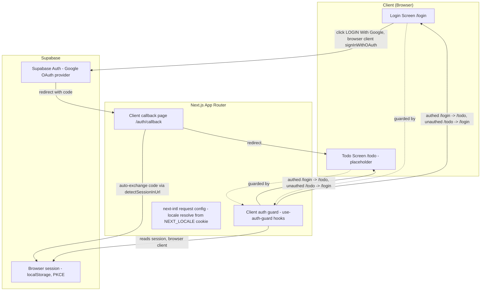
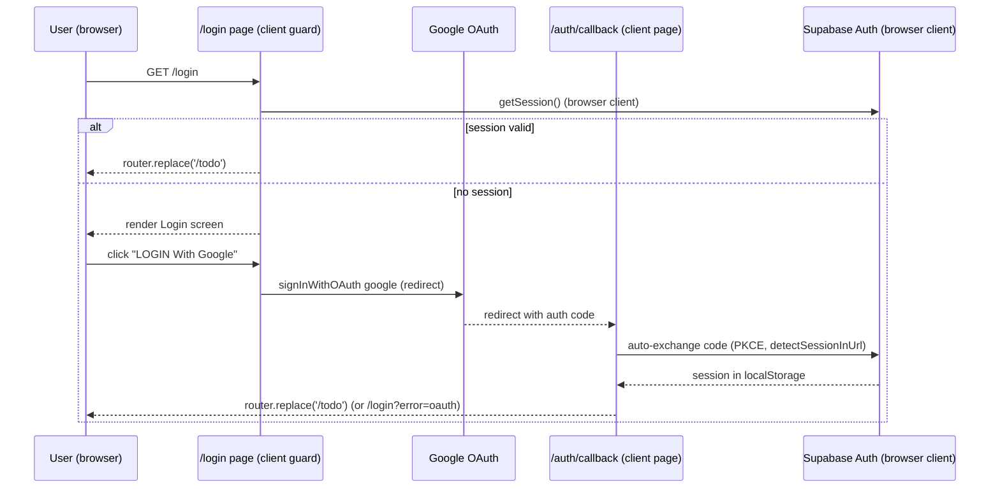

# Architecture

> Forward-drafted because the Login feature introduces the app's first auth layer.
> **Revised: CLIENT-ONLY auth** (per `clarifications.md`) — browser Supabase client only, PKCE,
> session in localStorage; NO `@supabase/ssr`, NO server client, NO `proxy.ts`/middleware. The
> route guard and OAuth callback run in the browser. Draft in the plan dir; promoted and reconciled
> to as-built at implement-start. Rationale belongs in an ADR, not here.

## System Architecture

## Tech Stack

| Layer | Technology | Version |
|-------|------------|---------|
| Frontend framework | Next.js (App Router) | 16.2.10 — breaking changes vs. pre-16 training data; confirm exact API against `node_modules/next/dist/docs/` |
| UI library | React | 19 |
| Styling | Tailwind CSS | v4 |
| Auth | Supabase Auth (`@supabase/supabase-js`, browser client, PKCE) | latest compatible with Next 16 — TBD (draft), confirm at implementation |
| Auth provider | Google OAuth | n/a (external) |
| i18n | next-intl (or equivalent per `clarifications.md`) | TBD (draft) |
| Database/Auth backend | Supabase (local instance for dev) | TBD (draft) |

## Data Flow

## Layering Notes (draft — confirm at implementation)

- **Single browser client:** `@supabase/supabase-js` `createClient` with `flowType: 'pkce'`,
  `detectSessionInUrl: true`, `persistSession: true`. No server or middleware client.
- **Client guard:** `lib/auth/use-auth-guard.ts` (`useRedirectIfAuthed` for `/login`,
  `useRequireAuth` for `/todo`) reads the session and redirects; exposes `checking` to gate a
  loading state and avoid flash-of-content.
- **i18n:** `NEXT_LOCALE` is resolved in the next-intl request config (NOT a middleware/proxy) —
  decoupled from auth.
- **OAuth callback:** a **client page** at `app/auth/callback/page.tsx` lets the browser client
  auto-exchange the `?code=`, then redirects to `/todo` (or `/login?error=oauth`).
- **`/todo`:** placeholder authenticated landing page only, gated client-side; no feature scope.
- **Security note:** client-only gating is UX-level, not a server boundary — noted for future
  hardening if `/todo` gains sensitive data.
